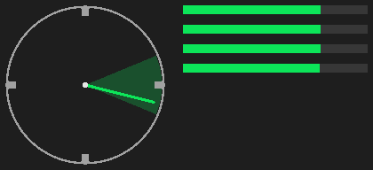
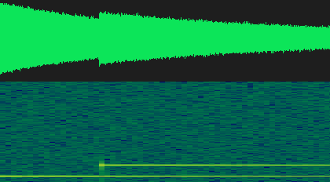

# Isaac Audio Sensors GUI Guide for Isaac Sim

This guide shows how to use the `Isaac Audio Sensors` Kit window in Isaac Sim.
It is written for someone who is new to Isaac Sim and new to this package.

The GUI is the reference Omniverse extension UX for this package. It lets you
select USD prims, author `ias:*` audio metadata, start a live audio array
sensor, inspect the latest frame and overlay status, and export JSON/JSONL
records. For the deeper Isaac Sim runtime contract and live evidence, see the
[Isaac Sim documentation](isaac_sim.md).

The current GUI authors metadata, source transforms, object attachments, and
reusable object sound profiles for sensor frames. Profiles set source metadata
used by frames and traces; they do not play audible audio, classify waveforms,
or integrate downstream ontology labels.

The control inventory below is derived from
`src/isaac_audio_sensors/isaac/extension_ui/` and
`scripts/live_omniverse_extension_ux.py`. The visible sections are:

- `Stage`
- `Author Array`
- `Author Source`
- `Sensor`
- `Instruments`
- `Replicator`
- `Export`

The screenshots in this guide are real captures of the `Isaac Audio Sensors`
window with one section expanded at a time. The `Instruments` image is the
compass+meter panel raster captured by the live UX gate (the same pixels the
compass widget displays).

## Before You Start

You need:

- Isaac Sim installed and able to open normally.
- A local checkout of this repository.
- The repository path available on the same machine running Isaac Sim.

In this guide, replace `<repo>` with your local checkout path. For example:

```text
<repo>/exts
```

If you are working from this repository checkout, the extension folder is:

```text
exts/isaac_audio_sensors.omni
```

The Extension Manager search path must point to the parent `exts/` directory,
not to the extension folder itself.

## Install Once for Icon Launches

The command-line `--ext-folder <repo>/exts` option is useful for one-off live
validation, but it only applies to that Isaac Sim process. If you normally open
Isaac Sim from its desktop icon, install the extension into Isaac's persistent
user extension folder once:

```bash
python3 scripts/install_isaac_sim_extension.py \
  --isaacsim-command <path-to-isaacsim>
```

The installer creates a symlink from Isaac Sim's built-in `extsUser` search
folder to this checkout's `exts/isaac_audio_sensors.omni` directory. It also
adds the versioned extension id to Kit's autoload list in
`~/.local/share/ov/data/Kit/Isaac-Sim Full/5.1/user.config.json`, backing up the
file first. After that, launching Isaac Sim from the icon should discover the
extension without extra launch arguments, and the `Window -> Isaac Audio
Sensors` menu plus `Ctrl+Alt+A` hotkey are available once the extension has
loaded.

Use `--dry-run` to preview the paths before writing, or `--no-autoload` if you
only want the extension to appear in Extension Manager and prefer enabling it
manually.

## Open the GUI

1. Launch Isaac Sim.
2. Open a stage. A new empty stage is enough for the first demo.
3. If you used the one-time installer above, open `Window -> Isaac Audio
   Sensors`.
4. If you did not install it persistently, open `Window -> Extensions`.
5. In the Extension Manager, add this repository's `exts/` directory as an
   extension search path.
6. Search for `Isaac Audio Sensors`.
7. Select the `THIRD PARTY` source tab if the extension is not visible under
   the default source filter.
8. Enable the extension named `Isaac Audio Sensors`.
9. Open `Window -> Isaac Audio Sensors` if the Kit window is not already
   visible.

When the extension starts successfully, it builds a window named
`Isaac Audio Sensors`. The window contains collapsible sections. You can
collapse sections while working or while capturing section-specific screenshots.
Closing the window with X only hides it; reopen it from
`Window -> Isaac Audio Sensors`. The registered Kit action is
`isaac_audio_sensors.omni::toggle_window`. When Kit hotkeys are available, the
default shortcut is `Ctrl+Alt+A`; change
`/exts/isaac_audio_sensors.omni/shortcut` to customize that binding.

In Extension Manager, the extension Overview should show the package README,
changelog, repository link, icon, preview image, `Simulation` category, and
audio/robotics keywords. The extension is marked as third-party/community
metadata so it appears under `THIRD PARTY`, not `NVIDIA`.

If the window does not appear:

- Confirm that the search path is `<repo>/exts`, not
  `<repo>/exts/isaac_audio_sensors.omni`.
- Confirm that the extension entry is enabled in `Window -> Extensions`.
- Try `Window -> Isaac Audio Sensors`.
- Try `Ctrl+Alt+A` if hotkeys are enabled.
- Disable and re-enable the extension.
- Check the Isaac Sim console/log for extension load errors.
- Confirm that the extension folder contains
  `exts/isaac_audio_sensors.omni/config/extension.toml`.
- Open or create a USD stage before pressing stage-dependent buttons.

## Window Basics

The window has a global status line at the bottom. Most buttons update that
status line. If a button cannot complete, the status line shows a readable error
such as `No USD stage is open.`, `No prim is selected.`, or
`array_prim_path must be an absolute USD prim path.`

Text fields accept ordinary strings. Numeric fields are displayed as editable
text fields, so invalid numeric text is rejected when an action runs. Checkboxes
toggle boolean settings. Menus are combo boxes with fixed choices.

Use USD absolute prim paths, such as:

```text
/World/Rig/AudioArray
/World/Sources/SpeakerA
/World/Rig
```

Do not use relative paths such as `World/Rig/AudioArray`.

## Stage Section


### What It Is For

`Stage` connects the GUI to the currently open USD stage and the currently
selected prims in Isaac Sim. Use this section before authoring metadata or
starting the sensor.

### When To Use It

Use it first, then return to it whenever you select a different prim in the
Stage tree or viewport.

### Controls

`Refresh` reads the current Isaac Sim stage and current selected prim paths. On
success, the stage label changes to something like:

```text
Stage ready. Selected: /World/Rig/AudioArray
```

If no stage is open, the status line reports:

```text
Stage selection failed: No USD stage is open.
```

`Use Array` copies the first selected prim path into the `Author Array` target
prim field. Use this after selecting the prim that should represent the
microphone array.

`Use Source` copies the first selected prim path into the `Author Source` target
prim field. Use this after selecting the prim that should represent the sound
source.

`Use Object` copies the first selected scene-object prim path into the object
attachment target. Use this after clicking an object such as an oven, sink,
cabinet, tool, prop, or procedural demo object in the viewport or Stage tree.

`Use Base` copies the first selected prim path into `Robot/Base`. Use this when
the array is mounted under a robot, rig, or moving base prim and you want the
sensor binding to treat that prim as the base frame.

`Discovery Roots` is a text field containing one or more USD root paths to scan.
The default is:

```text
/World
```

Separate multiple roots with commas or semicolons, for example:

```text
/World/Robot, /World/Sources
```

`Robot/Base` is the optional robot or base prim path. Leave it empty for a
simple static demo. Set it to a path such as `/World/Rig` when the array is
mounted under that base.

`Object` is the selected scene object used by the source attachment workflow.
It is editable, but the normal path is to select the object in Isaac Sim and
click `Use Object`.

`Create Demo Object` authors a minimal procedural object prim at `/World/Oven`
when the current stage does not already have a convenient object. This is only a
test/demonstration object; it is not a kitchen asset or sound profile.

`Discover` scans the configured discovery roots for audio arrays and sources.
It uses authored `ias:*` metadata and supported stage conventions. It also
lists simple non-audio scene objects that can be used for attachment. On
success, the status line reports how many arrays, sources, and objects were
found, and the discovery label lists their ids.

### Expected Output

After `Refresh`, the stage label should say the stage is ready and should list
the selected prim or `none`.

After `Use Array`, `Use Source`, `Use Object`, or `Use Base`, the target field
in the matching section should update.

After `Discover`, the discovery label should show array and source ids. For the
default first demo, expect ids like:

```text
Arrays: rig_front | Sources: speaker_a | Objects: Oven
```

## Author Array Section


### What It Is For

`Author Array` creates or updates microphone-array metadata on a USD prim. This
is how a normal Isaac Sim prim becomes discoverable as an audio array.

### When To Use It

Use this after opening a stage and deciding which prim represents the array. You
can select an existing prim and click `Use Array`, or you can type a new target
path and let the extension define a minimal prim there.

### Controls

`Target Prim` is the USD prim path that receives array metadata. The default is:

```text
/World/Rig/AudioArray
```

If the prim already exists, the extension attaches or updates metadata on that
prim. If it does not exist, the extension defines a minimal `Xform` prim.

`Array ID` is the stable id written into array metadata. The default is:

```text
rig_front
```

Use a short id that describes the array, such as `rig_front`,
`headset_left_right`, or `base_array`.

`Layout` chooses the microphone layout. The visible choices are:

- `quad_front`
- `quad_cross`
- `stereo_y`
- `two_mic_y`
- `mono`

`Sample Rate` is the sample rate written into the array metadata. The default
is:

```text
48000
```

`Convention` is a visible, non-editable label showing the coordinate convention:

```text
x_forward_y_right_z_up_clockwise_bearing
```

`Child Mics` is a checkbox. When enabled, `Create/Attach Array` also authors
child microphone prims under the array prim. For example, a quad layout creates
children under:

```text
/World/Rig/AudioArray
```

`Create/Attach Array` authors the array metadata. It validates the target path,
layout, and sample rate first.

### Microphone Rig Profiles

`Rig Profile ID` selects a reusable microphone rig preset. Rig profiles are
listener hardware presets, not sound profiles: microphones do not emit sound. A
rig profile defines the microphone ids, the relative microphone offsets in the
array frame, per-microphone gains, the sample rate, a local mount offset and
orientation for robot mounting, and an optional recommended mount prim path.
The built-in rig profile ids are `alex_head_quad`, `alex_chest_stereo`,
`unitree_head_stereo`, and `unitree_base_quad`.

`Select Rig Profile` validates the typed rig profile id and updates the rig
summary label.

`Apply Rig Profile` writes the selected rig to the current array prim: layout,
sample rate, microphone ids and relative offsets, per-microphone gains on the
child microphone prims, and `ias:rig_profile_id` metadata. It also fills the
`Array Offset` and `Array Local Yaw/Pitch/Roll` fields from the rig's mount
pose. When the rig defines a recommended mount prim that exists on the stage,
the status line mentions it; attaching remains an explicit user action. Keep
`Child Mics` enabled so per-microphone gains survive discovery.

The rig library, the selected rig profile id, and the applied rig snapshot are
exported and restored through `Export Config` / `Load Config`, so a rig setup
can be reused across stages and sessions.

### Array Pose Controls

`Array Pos X`, `Array Pos Y`, and `Array Pos Z` are the array's world position
in meters. `Array Yaw`, `Array Pitch`, and `Array Roll` are the array's world
orientation in degrees. Orientation matters more for the array than for
sources: the array frame defines what `straight`, `left`, and `right` mean for
bearing and sector outputs. A yaw of `90` turns the array's forward axis from
`+X` to `+Y`, so a source that was `straight` becomes `left`.

`Read Array Transform` copies the currently selected array prim's live USD
world position and orientation into the pose fields. Use it after selecting an
existing array in the viewport or Stage tree.

`Apply Array Pose` writes the pose fields to the target array prim transform
and to the `ias:position_world` / `ias:orientation_world_quat` metadata.

You can also move or rotate the array prim directly with Isaac Sim's normal
transform gizmo. Click `Update` in the `Sensor` section afterwards; the next
frame rereads the live USD transform and recomputes the bearing, the sector,
the microphone world positions, and the per-microphone RMS from the new array
pose.

### Mount The Array On A Robot Or Object

`Array Offset X`, `Array Offset Y`, and `Array Offset Z` are the array's local
position offset in meters relative to its mount prim. `Array Local Yaw`,
`Array Local Pitch`, and `Array Local Roll` are the local orientation offset in
degrees. For example, an offset of `0.0, 0.0, 0.1` mounts the array ten
centimeters above a robot head link.

`Attach Array To Object` moves the current array (including its child
microphone prims) under the selected object or robot prim and writes
array-binding metadata plus the local mount pose. Select the mount prim first
with `Use Object` (or `Use Base` for a robot base link); typical mounts are
robot links such as an Alex head/base link or a Unitree body link. The
attachment is a real parent/child transform relationship in the USD hierarchy,
so moving or rotating the robot with Isaac Sim's normal transform gizmo changes
the array world pose read by the sensor on the next `Update`.

`Detach Array` moves the array (with its child microphones) back to a
standalone `/World/AudioArrays/...` path at its current world pose and clears
the array-binding metadata.

### Expected Output

On success, the status line reports:

```text
Authored array rig_front at /World/Rig/AudioArray.
```

The array should then be discoverable from the `Stage` section if the discovery
roots include its path.

After applying an array pose, the status line reports the position and yaw that
were written. With the sensor started, rotating the array by 90 degrees of yaw
while a source sits straight ahead changes the next frame's sector from
`straight` to `left` and shifts every microphone world position and RMS value.

For the robot/object mount workflow:

1. Select the robot or object prim, such as an Alex head link.
2. Click `Use Object`.
3. Set `Array Offset X/Y/Z` and `Array Local Yaw/Pitch/Roll`.
4. Click `Attach Array To Object`.
5. Move or rotate the robot with Isaac Sim's normal transform gizmo.
6. Click `Update`.

The array status label should show the attached array path under the mount, the
changed world array position and orientation, and the changed microphone world
positions. The latest-frame label shows the changed bearing and sector. If the
mount prim is deleted while the array is attached, the status line reports a
readable missing-mount message instead of silently succeeding.

## Author Source Section


### What It Is For

`Author Source` creates or updates sound-source metadata on a USD prim. This is
how a normal Isaac Sim prim becomes discoverable as an audio source.

### When To Use It

Use this after authoring or selecting the array. Select an existing source prim
and click `Use Source`, or type a new target path and let the extension define a
minimal source prim.

### Controls

`Target Prim` is the USD prim path that receives source metadata. The default
is:

```text
/World/Sources/SpeakerA
```

`Source ID` is the stable id written into source metadata. The default is:

```text
speaker_a
```

`Class` is the semantic label for the source. The default is:

```text
Speech
```

Use labels such as `Speech`, `Alarm`, `Vehicle`, or another class meaningful to
your simulation.

`Audio URI` is the audio asset path or generated audio URI. The default is:

```text
generated://impulse
```

The first demo can use the default. For a real project, point this to the sound
asset you want the source to represent.

`Directivity` is the source directivity metadata label. It is diagnostic in the
current v1 backends.

`Profile ID` selects a reusable sound profile. The built-in profile ids include
`speech_generic`, `oven_stove`, `sink_water`, `door_knock`, and
`footsteps_movement`.

`Select Profile` validates the typed profile id and updates the profile summary.

`Auto From Object` matches the selected or attached object label against the
profile alias library. For example, object labels such as `Oven`,
`microwaveoven`, `Sink`, `Door`, or `footsteps` select matching metadata
presets without requiring a specific demo scene.

`Apply Profile` writes the selected profile's metadata to the current source
prim: native `filePath`, `ias:source_id`, `ias:class_label`,
`ias:audio_asset_path`, timing, gain, and directivity. Applying a profile keeps
the current source position when it is standalone and keeps the source attached
under its object when it is object-attached.

`Position X`, `Position Y`, and `Position Z` are the standalone source prim
position in meters. The default source placement is:

```text
2.0, 0.0, 0.0
```

`Read Selected Transform` copies the currently selected source prim's live USD
world position into the position fields. Use it after selecting an existing
source in the viewport or Stage tree.

`Apply Position` writes the position fields to the target source prim transform
and to the `ias:position_world` metadata.

`Local Offset X`, `Local Offset Y`, and `Local Offset Z` are the source offset
in meters when the source is attached under a scene object. For example, an
offset of `0.0, 0.5, 0.0` places the source half a meter to the object's local
right. When the object moves, the source world pose used by the next sensor
frame changes with the object.

`Front`, `Right`, `Left`, and `Behind` are deterministic placement presets for
the default demo frame:

```text
Front:  2.0,  0.0, 0.0
Right:  0.0,  2.0, 0.0
Left:   0.0, -2.0, 0.0
Behind: -2.0, 0.0, 0.0
```

`Start` is the source start time in seconds. The default is:

```text
0.0
```

`Duration` is the source active duration in seconds. The default is:

```text
1.0
```

`Gain dB` is the source gain in decibels. The default is:

```text
0.0
```

`Create/Attach Source` authors the source metadata, native sound attributes,
and current position fields used by the extension.

`Attach Source To Object` moves or creates the current source under the selected
object path and writes object-binding metadata plus the local offset. This
creates a real parent/child transform relationship in the USD hierarchy, so
moving the object with Isaac Sim's normal transform gizmo changes the source
world pose read by the sensor on the next `Update`.

`Detach Source` moves the source back to a standalone `/World/Sources/...` path
at its current world pose and clears the object-binding metadata.

### Expected Output

On success, the status line reports:

```text
Authored source speaker_a at /World/Sources/SpeakerA.
```

The source should then be discoverable from the `Stage` section if the
discovery roots include its path.

After applying a profile and running `Update`, the emitted frame detections use
the profile's `source_id`, `class_label`, and `audio_asset_path`. This is
metadata for sensors and traces only; the GUI does not preview or render audio.

After the sensor is started, you can move the same source prim with Isaac Sim's
normal transform gizmo. Click `Update` again; the next frame rereads the live USD
transform and the latest-frame label shows the source path, source position,
bearing, and sector used for that frame.

For the object attachment workflow:

1. Select or create the object prim, such as `/World/Oven`.
2. Click `Use Object`.
3. Set `Local Offset X/Y/Z`.
4. Click `Attach Source To Object`.
5. Move the object with Isaac Sim's normal transform gizmo.
6. Click `Update`.

The latest-frame label should show the attached source path under the object,
the changed world source position, and the changed bearing/sector. If the object
is deleted or missing when a loaded config expects it, the status line reports a
readable missing-object message instead of silently succeeding.

## Sensor Section


### What It Is For

`Sensor` configures and runs the live `IsaacAudioArraySensor` for the current
stage. It controls the backend, update cadence, event limit, overlay setting,
JSONL trace writer, and start/stop/update lifecycle.

### When To Use It

Use it after the stage has at least one authored or discoverable array. A source
is needed if you want detections in the latest frame.

### Controls

`Backend` selects the implemented v1 audio backend. The visible choices are:

- `geometry_only`
- `tdoa_synthetic`
- `room_acoustics`

For a first demo, use `tdoa_synthetic`. `room_acoustics` requires the optional
room-acoustics dependency in the Isaac runtime.

`Ambiguity` selects the TDOA ambiguity policy. The visible choices are:

- `front_hemisphere`
- `none`

Use `none` for the simplest first demo. Use `front_hemisphere` when you want the
two-microphone ambiguity handling to prefer the front hemisphere.

`Period s` is the update period in seconds. The default is:

```text
0.05
```

The value must be positive and finite.

`Max Events` limits how many detections can appear in a frame. The default is:

```text
8
```

Use `0` only when you intentionally want no detections to be retained.

`Overlay` toggles debug overlay primitive generation and drawing. When enabled,
updates record microphone, source, bearing-ray, and sector-wedge primitives.
If Isaac debug draw is unavailable, the extension can still report serialized
overlay primitives.

`USD Debug` authors the same primitives as persistent USD geometry: Sphere
prims for microphones and sources, BasisCurves for bearing rays and sector
wedges, colored like the overlay (green clear / red occluded). Unlike the
transient overlay, the geometry survives pause, camera moves, and screenshots,
and is visible to anything that reads the stage. Prims are written to the
session layer under `Debug Root` (default `/World/IasAudioDebug`), so your
stage file stays clean; they update in place on every sensor update and
stale prims are pruned. The geometry intentionally persists after `Stop` so
you can inspect the last frame - press `Clear Debug Geometry` to remove the
subtree. The status line below the overlay label reports the authored prim
count and root.

`JSONL` toggles the package-native JSONL trace writer.

`Writer Path` is the JSONL output path. The default is:

```text
outputs/isaac_audio_sensors/extension_trace.frames.jsonl
```

`Start` builds or replaces the live sensor from the current UI state and starts
it. If the explicit array prim exists, it uses that prim. Otherwise it tries
semantic discovery from the configured roots.

`Stop` stops the live sensor but keeps the latest frame available for export.

`Update` forces one sensor frame. It updates the latest-frame label, appends to
the JSONL trace when `JSONL` is enabled, updates overlay status, and writes a
Replicator frame if Replicator recording is enabled and started.

The latest-frame label reports:

- frame id
- detection count
- backend
- first detection bearing
- first detection sector

The overlay label reports:

- overlay primitive count
- overlay labels
- overlay status

### Expected Output

After `Start`, the status line should report the configured backend and array.
For example:

```text
Configured tdoa_synthetic sensor for array rig_front.
Sensor started.
```

After `Update`, expect a status similar to:

```text
Updated <frame-id>: 1 detection(s), 7 overlay primitive(s).
```

If `JSONL` is enabled, the trace should be written to:

```text
outputs/isaac_audio_sensors/extension_trace.frames.jsonl
```

## Instruments Section



### What It Is For

`Instruments` turns the latest frame into live visuals instead of raw text:

- A polar bearing **compass**: the array's forward direction points up, bearings
  increase clockwise (the v1 coordinate convention), the needle shows the
  estimated bearing of the first detection, and a translucent wedge marks the
  bearing sector. The needle is green when the source is clear and red when
  Isaac raycast occlusion marks it occluded. Thin dim needles mark unresolved
  candidate bearings when the backend reports ambiguity.
- **Per-mic RMS meters**: one bar per microphone (front, right, rear, left,
  then any extra mics alphabetically). The fill maps the linear frame RMS to a
  dB scale with a -60 dB floor; the row label shows the exact dB value.
- A **detection timeline**: the most recent detections, newest first, each row
  showing the detection time, class or source ID, bearing, sector, and whether
  the bearing ray was occluded.

### When To Use It

Watch the instruments while the sensor is running (after `Start` in the
`Sensor` section, or after manual `Update` clicks). They answer "where is the
sound coming from, how loud is it per mic, and what happened recently" at a
glance, without parsing the status labels.

### Controls

The section is read-only; it refreshes on every sensor update. The text line
under the compass mirrors the drawing for copy/paste and headless use:

```text
bearing 104.2 deg | sector right | confidence 0.93 | clear
```

When no detection is available the compass reports `no bearing`, the meters
stay empty, and the timeline keeps the last recorded events (up to 50 are
retained per session).

### Expected Output

With the first-demo scene (source at `(2.0, 0.0, 0.0)`, i.e. straight ahead),
expect the needle near `0 deg`, sector `straight`, and four meter rows with
similar dB values. Moving the source to the right swings the needle to ~90 deg
and the `right` mic meter rises first. The live UX gate records the same data
under `instruments` in
`outputs/isaac_audio_sensors/omniverse_extension_live_ux.json` and writes the
compass+meter panel to
`outputs/isaac_audio_sensors/omniverse_extension_live_ux.instruments.png`.

## Audio Output Section



### What It Is For

`Audio Output` connects the GUI to the package's multichannel WAV export
(`core.io.waveforms`) and previews the result: a min/max waveform envelope, a
numpy-STFT spectrogram (low frequencies at the bottom, -80 dB floor), and
best-effort audition of the latest exported file.

### When To Use It

Use it with the `room_acoustics` backend - that is the only v1 backend that
synthesizes waveforms, and it requires the optional `room` extra
(`pyroomacoustics`, `soundfile`) inside the Isaac python environment. With
`geometry_only` or `tdoa_synthetic` the panel keeps reporting
`No waveform yet`.

### Controls

`WAV Export` toggles waveform export for the next `Start`. The setting is
applied when the sensor is (re)configured, so toggle it before starting.

`WAV Dir` is the output directory, resolved against the package output root.
The default writes to:

```text
outputs/isaac_audio_sensors/live_waveforms
```

`WAV Mode` selects the writer:

- `per_frame` - one deterministic `<frame-id>.wav` per update.
- `session` - one growing session WAV with overlap-added reverb tails.

`Play` auditions the most recent WAV via `omni.audioplayer` when that Kit
extension is available, falling back to the system audio player. `Stop Audio`
stops playback. `Open WAV Folder` opens the resolved output directory. The
status line under the buttons reports exactly which path played (or why
nothing could).

### Expected Output

After an update on the `room_acoustics` backend, the label shows the latest
file with its shape, for example:

```text
Latest WAV: outputs/isaac_audio_sensors/live_waveforms/frame_000003.wav | 4 ch | 16000 Hz | 1.00 s
```

and the waveform/spectrogram images refresh for that file. The live UX gate
exercises this end to end on the room backend and records the result under
`audio_output` in `outputs/isaac_audio_sensors/omniverse_extension_live_ux.json`
(status `skipped` with a reason when the Isaac python lacks the room extra).

## Replicator Section


### What It Is For

`Replicator` controls the optional Omniverse-native recording path. This is
separate from the package-native JSON/JSONL export path.

Replicator is optional extension functionality. The core package import,
`AudioSensorFrame`, JSON/JSONL export, Isaac Sim sensor, and Isaac Lab sensor do
not require Replicator.

### When To Use It

Use it only if you want Omniverse Replicator writer artifacts in addition to the
package-native JSON/JSONL files.

### Controls

`Enable` toggles whether `Update` should write Replicator frames. Enabling this
does not start the recorder by itself; use the Replicator `Start` button.

`Output Dir` is the Replicator output directory. The default is:

```text
outputs/isaac_audio_sensors/replicator
```

`Writer` is the Replicator writer name. The default is:

```text
IsaacAudioSensorFrameWriter
```

`Annotator` is the Replicator annotator name. The default is:

```text
IsaacAudioSensorFrameAnnotator
```

`Start` starts the Replicator recorder and registers the writer path when the
Isaac runtime exposes the needed Replicator APIs.

`Flush` flushes Replicator writer output.

`Stop` stops Replicator recording without clearing the configured settings.

The Replicator status label reports whether the recorder is started, whether
the writer is registered, how many writes and flushes happened, and the latest
artifact path when available.

### Expected Output

After Replicator `Start`, the status line should report:

```text
Replicator recording started at outputs/isaac_audio_sensors/replicator.
```

After `Update` while Replicator is enabled and started, Replicator artifacts are
expected under:

```text
outputs/isaac_audio_sensors/replicator/
```

If Replicator is unavailable, keep using the package-native JSON/JSONL paths in
the `Sensor` and `Export` sections.

## Export Section


### What It Is For

`Export` writes the latest frame and a reusable GUI/stage-binding config. It can
also load a saved config back into the GUI.

### When To Use It

Use `Export Latest` after at least one successful `Update`. Use
`Export Config` whenever you want to save the current GUI state and binding
summary. Use `Load Config` when you want to restore settings from a previous
run.

### Controls

`Latest JSON` is the output path for the latest frame JSON. The default is:

```text
outputs/isaac_audio_sensors/extension_latest_frame.json
```

`Config JSON` is the output path for the reusable config summary. The default
is:

```text
outputs/isaac_audio_sensors/extension_binding.json
```

`Load Config` is the input path for loading a config summary. The default is:

```text
outputs/isaac_audio_sensors/extension_binding.json
```

`Export Latest` writes the latest `AudioSensorFrame` v1 JSON record. It fails
with a readable error if no frame has been produced yet.

`Export Config` writes a JSON summary of the current backend, array/source
paths, source settings, sound-profile library, selected profile id,
object-label/profile mappings, applied source-profile snapshot, discovery
roots, robot/base binding, lifecycle settings, writer settings, Replicator
settings, latest-frame summary, and overlay summary.

`Load Config` reads a config summary with schema version:

```text
ias.omni_extension_binding.v1
```

and pushes the saved settings back into the GUI fields.

Older configs that do not contain the optional `sound_profiles` block still
load. New profile configs report readable import errors if a selected profile id
or object-label mapping references a profile that is not in the exported
library.

### Expected Output

After `Export Latest`, expect:

```text
outputs/isaac_audio_sensors/extension_latest_frame.json
```

After `Export Config`, expect:

```text
outputs/isaac_audio_sensors/extension_binding.json
```

If JSONL is enabled in `Sensor`, expect:

```text
outputs/isaac_audio_sensors/extension_trace.frames.jsonl
```

If Replicator is enabled and started, expect additional files under:

```text
outputs/isaac_audio_sensors/replicator/
```

## Work From the Viewport

The viewport is the primary way to place things; the numeric fields remain the
precision alternative.

### Follow Selection

Enable `Follow Selection` in the `Stage` section and run `Discover` once.
Clicking a prim in the viewport then routes it automatically:

- a discovered microphone array fills `Author Array -> Target Prim`,
- a discovered sound source fills `Author Source -> Target Prim`,
- anything else becomes the `Object` target (with its label resolved), exactly
  as if you had pressed `Use Object`.

The status line reports each adoption, for example
`Viewport selection adopted as array: /World/Rig/AudioArray`. Selection
following uses Kit stage events when available and falls back to polling on
the sensor update tick otherwise.

### Manipulator-Driven Placement

Enable `Live Sync Pose` in the `Author Array` or `Author Source` section, then
move the prim with the standard viewport move/rotate gizmo. The numeric
position (and, for arrays, orientation) fields mirror the manipulated prim on
every update tick, and the running sensor already re-resolves prim poses on
each capture - so dragging a source across the scene swings the compass and
meters live without touching any field.

While `Live Sync Pose` is enabled the fields are owned by the prim: manual
edits are overwritten on the next tick. Disable the toggle to type precise
values, then press `Apply Array Pose` / `Apply Position` as before.

## Use Audio In Action Graphs

When `omni.graph.core` is available, the extension registers a runtime
OmniGraph node so audio wires into Action Graphs the way cameras and lidars
do:

```text
isaac_audio_sensors.omni.IsaacAudioSensorFrame
```

The `Sensor` section shows the registration status (registered, unavailable,
or the exact failure reason). Add the node to an Action Graph and read its
outputs - they refresh from the newest frame the sensor recorded:

- `frameId` (token), `timestampMs` (int64), `detectionCount` (int)
- `bearingDeg` (double, NaN when no detection), `sector` (token),
  `occluded` (bool) - first detection of the frame
- `micIds` (token[]) and `micRms` (double[]) - aggregate per-mic RMS, aligned
- `frameJson` (token) - the full frame serialized with the v1 trace schema

`inputs:arrayKey` filters by array prim path; leave it empty for the most
recently updated array.

If the node type is not available in your Kit build, the same data is one
import away in a Script Node:

```python
from isaac_audio_sensors.isaac.frame_registry import get_latest_frame

frame = get_latest_frame()  # newest AudioSensorFrame, or None
if frame is not None and frame.detections:
    bearing = frame.detections[0].doa.estimated_bearing_deg
```

The registry is published on every sensor update and cleared when the sensor
closes.

## First Demo Pipeline

This pipeline starts from a simple stage and produces a latest frame, JSONL
trace, config export, and optional Replicator output.

1. Open Isaac Sim.
2. Create or open a simple stage. A new empty stage is fine.
3. Open `Window -> Extensions`.
4. Add `<repo>/exts` as an Extension Manager search path.
5. Enable `Isaac Audio Sensors`.
6. Confirm that the `Isaac Audio Sensors` window is visible.
7. In Isaac Sim, create or select an array prim. For the default demo, use:

   ```text
   /World/Rig/AudioArray
   ```

8. In `Stage`, click `Refresh`.
9. Click `Use Array`, or type `/World/Rig/AudioArray` into
   `Author Array -> Target Prim`.
10. In `Author Array`, set:

    ```text
    Array ID: rig_front
    Layout: quad_front
    Sample Rate: 48000
    Child Mics: enabled
    ```

11. Click `Create/Attach Array`.
12. Create or select a sound source prim. For the default demo, use:

    ```text
    /World/Sources/SpeakerA
    ```

13. In `Stage`, click `Use Source`, or type `/World/Sources/SpeakerA` into
    `Author Source -> Target Prim`.
14. In `Author Source`, set:

    ```text
    Source ID: speaker_a
    Class: Speech
    Audio URI: generated://impulse
    Directivity: omni
    Profile ID: speech_generic
    Position X: 2.0
    Position Y: 0.0
    Position Z: 0.0
    Start: 0.0
    Duration: 1.0
    Gain dB: 0.0
    ```

15. Click `Apply Position` or one of the source placement presets.
16. Click `Create/Attach Source`.
17. To use object metadata, select or create an object such as `/World/Oven`,
    click `Use Object`, click `Auto From Object`, then click `Apply Profile`.
18. Optionally select a robot or rig base prim, such as `/World/Rig`, and click
    `Use Base`. Leave `Robot/Base` empty if there is no base prim.
19. In `Stage`, leave `Discovery Roots` as `/World` for the default demo.
20. Click `Discover`.
21. Confirm the discovery label lists one array and one source, such as
    `rig_front` and `speaker_a`.
22. In `Sensor`, set:

    ```text
    Backend: tdoa_synthetic
    Ambiguity: none
    Period s: 0.05
    Max Events: 8
    Overlay: enabled
    JSONL: enabled
    Writer Path: outputs/isaac_audio_sensors/extension_trace.frames.jsonl
    ```

22. Click `Start`.
23. Click `Update`.
24. Inspect the latest-frame label. It should show a frame id, detection count,
    backend, source path, source position, bearing, and sector.
25. Move `/World/Sources/SpeakerA` with Isaac Sim's transform gizmo, then click
    `Update` again. The source position, bearing, and sector should change.
26. Move or rotate `/World/Rig/AudioArray` with Isaac Sim's transform gizmo (or
    set `Array Yaw` to `90` and click `Apply Array Pose`), then click `Update`
    again. The bearing, sector, microphone world positions, and per-microphone
    RMS should change while the source position stays the same.
27. Optionally mount the array: select a robot link or object prim, click
    `Use Object`, set `Array Offset X/Y/Z`, click `Attach Array To Object`,
    move the mount prim with the gizmo, then click `Update`. The array world
    pose and the listener-dependent frame outputs should follow the mount.
26. Inspect the overlay label. It should show an overlay primitive count and
    labels. If the live debug drawer is unavailable, serialized overlay status
    can still be reported.
27. In `Export`, keep:

    ```text
    Latest JSON: outputs/isaac_audio_sensors/extension_latest_frame.json
    Config JSON: outputs/isaac_audio_sensors/extension_binding.json
    Load Config: outputs/isaac_audio_sensors/extension_binding.json
    ```

28. Click `Export Latest`.
29. Click `Export Config`.
30. Optionally use Replicator:
    - In `Replicator`, enable `Enable`.
    - Keep `Output Dir` as `outputs/isaac_audio_sensors/replicator`.
    - Click the Replicator `Start` button.
    - Return to `Sensor` and click `Update` again.
    - Return to `Replicator` and click `Flush`.
31. In `Sensor`, click `Stop`.
32. If Replicator was started, click the Replicator `Stop` button.

The main expected files are:

```text
outputs/isaac_audio_sensors/extension_latest_frame.json
outputs/isaac_audio_sensors/extension_trace.frames.jsonl
outputs/isaac_audio_sensors/extension_binding.json
outputs/isaac_audio_sensors/replicator/
```

## Troubleshooting

### No Stage

Symptom:

```text
Stage selection failed: No USD stage is open.
```

Fix:

- Create a new stage in Isaac Sim.
- Open an existing USD stage.
- Click `Refresh` again after the stage is open.

### No Selected Prim

Symptom:

```text
Selection binding failed: No prim is selected.
```

Fix:

- Select a prim in the Stage tree or viewport.
- Click `Refresh`.
- Then click `Use Array`, `Use Source`, or `Use Base`.

You can also type the target path manually.

### Bad Prim Path

Symptom:

```text
array_prim_path must be an absolute USD prim path.
```

or:

```text
source_prim_path must be an absolute USD prim path.
```

Fix:

- Start paths with `/`.
- Use paths under `/World`, such as `/World/Rig/AudioArray`.
- Do not use relative paths such as `World/Rig/AudioArray`.

### Discover Finds Nothing

Symptom:

```text
Discovery found 0 array(s), 0 source(s).
```

Fix:

- Confirm `Discovery Roots` includes the paths you want to scan.
- Click `Create/Attach Array` and `Create/Attach Source` before discovery.
- Confirm the target prim paths are under the discovery roots.
- Try the default root `/World`.
- Check that you are working in the stage you expect.

### Array Move Does Not Change The Frame

Symptom: the array was moved or rotated, but the latest frame still shows the
old bearing and sector.

Fix: click `Update` after moving the array; each update rereads the live USD
transform. If the array is attached to a mount, move the mount prim (the array
prim itself only holds the local offset). If the mount prim was deleted, the
status line reports a readable missing-mount message; select another mount or
click `Detach Array`.

### Start Or Update Fails

Possible causes:

- No stage is open.
- The array prim path is invalid.
- No array was authored or discovered.
- `Period s` is zero, negative, or not numeric.
- `Max Events` is negative or not numeric.
- `room_acoustics` is selected but the optional dependency is unavailable in the
  Isaac runtime.
- Replicator is enabled but Replicator recording was not started.

Fix:

- Use `tdoa_synthetic` for the first demo.
- Keep `Period s` at `0.05`.
- Keep `Max Events` at `8`.
- Run `Discover` and confirm at least one array.
- If Replicator is not needed, leave Replicator disabled.
- Read the global status line for the exact failing action.

### No Overlay

Possible causes:

- `Overlay` is disabled.
- `Update` has not run yet.
- There are no detections or no configured source.
- Isaac debug draw is unavailable in the current Isaac Sim runtime.

Fix:

- Enable `Overlay`.
- Click `Start`, then `Update`.
- Confirm a source exists and is discoverable.
- Check the overlay label. Serialized overlay primitives can still be reported
  even if live debug drawing is unavailable.

### Replicator Unavailable

Symptom:

- Replicator `Start`, `Update`, or `Flush` reports an `omni.replicator.core`,
  writer registry, output path, write, or flush error.

Fix:

- Treat Replicator as optional.
- Keep using `Export Latest`, `Export Config`, and the JSONL writer path.
- Confirm package-native outputs:

  ```text
  outputs/isaac_audio_sensors/extension_latest_frame.json
  outputs/isaac_audio_sensors/extension_trace.frames.jsonl
  outputs/isaac_audio_sensors/extension_binding.json
  ```

### Export Path Errors

Possible causes:

- `Export Latest` was clicked before a successful `Update`.
- The output path points to a directory instead of a file.
- The parent directory cannot be created.
- The path is outside a writable location.

Fix:

- Click `Start`, then `Update`, then `Export Latest`.
- Use the default `outputs/isaac_audio_sensors/...` paths first.
- Make sure the path ends in `.json` for JSON exports and `.jsonl` for the
  JSONL writer.
