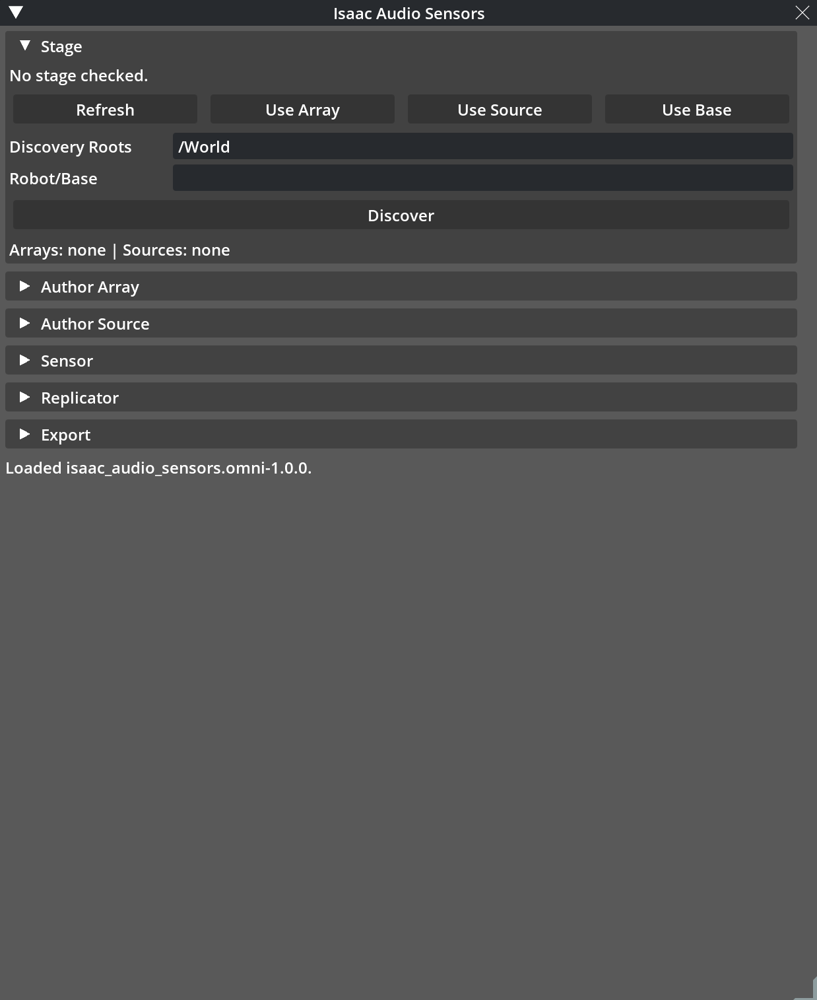
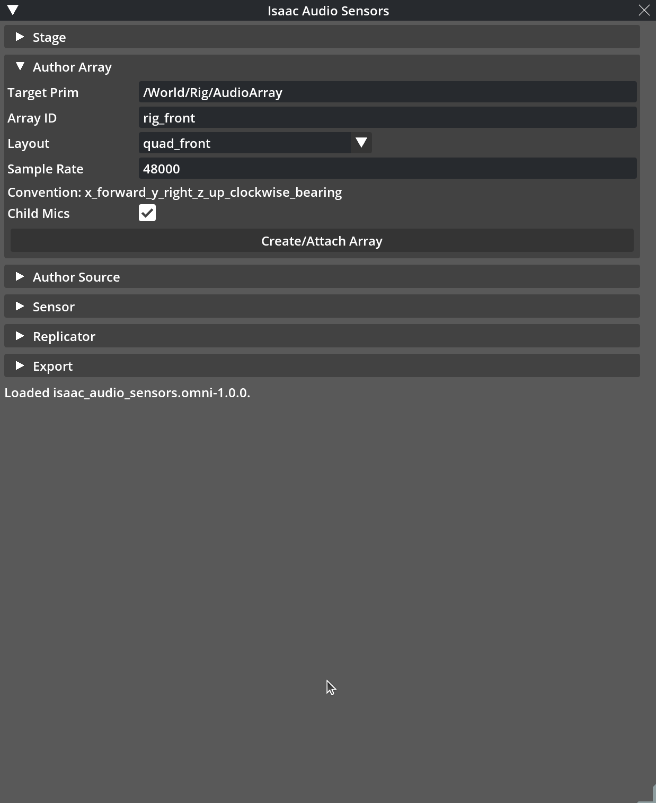
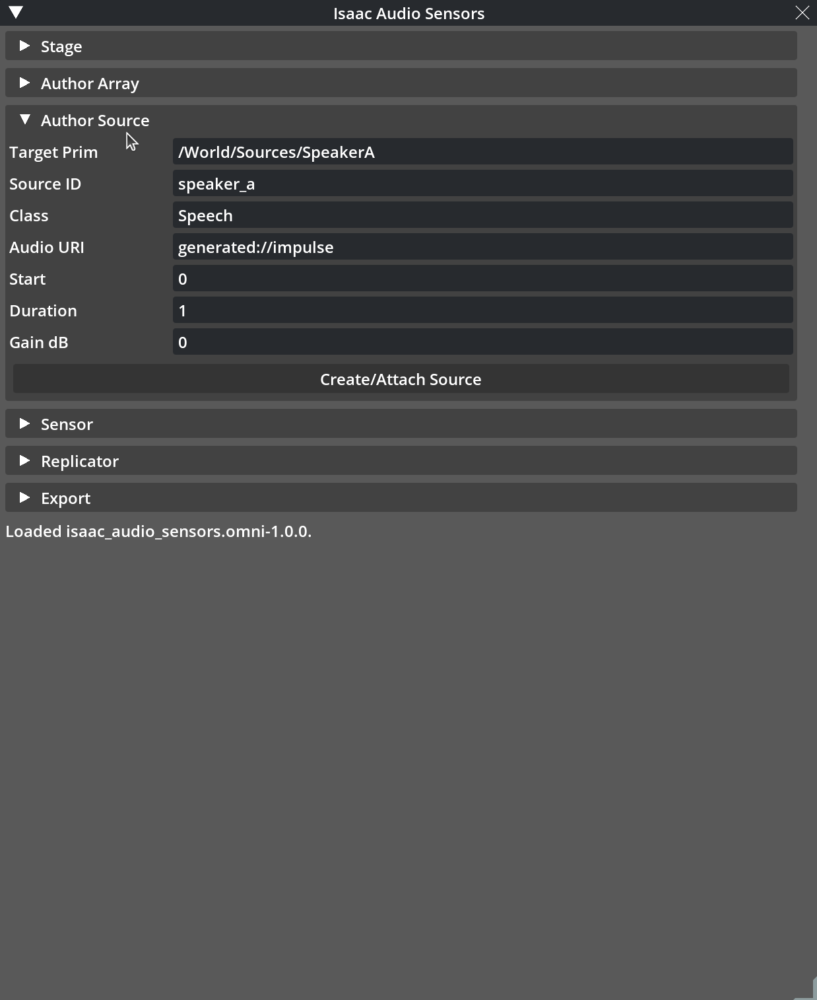
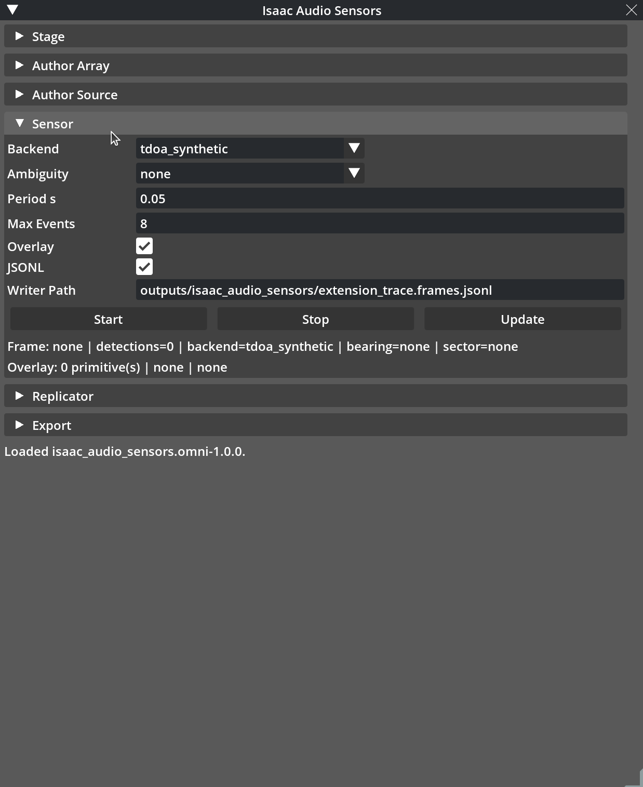
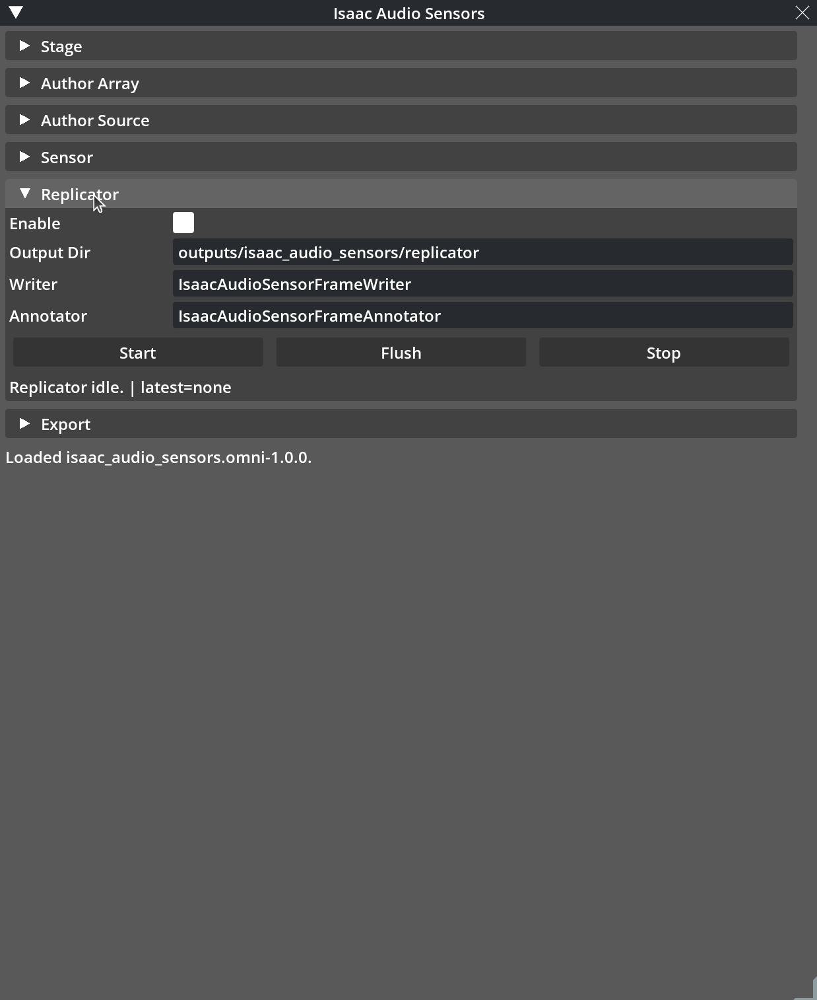
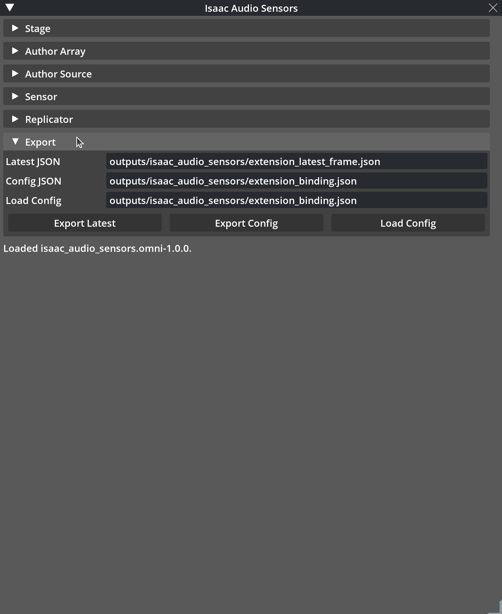

# Isaac Audio Sensors GUI Guide for Isaac Sim

This guide shows how to use the `Isaac Audio Sensors` Kit window in Isaac Sim.
It is written for someone who is new to Isaac Sim and new to this package.

The GUI is the reference Omniverse extension UX for this package. It lets you
select USD prims, author `ias:*` audio metadata, start a live audio array
sensor, inspect the latest frame and overlay status, and export JSON/JSONL
records. For the deeper Isaac Sim runtime contract and live evidence, see the
[Isaac Sim documentation](isaac_sim.md).

The current GUI authors metadata, source transforms, and object attachments for
sensor frames. It does not play audible audio, assign object sound profiles, or
integrate downstream ontology labels.

The control inventory below is derived from
`src/isaac_audio_sensors/isaac/extension_ui.py` and
`scripts/live_omniverse_extension_ux.py`. The visible sections are:

- `Stage`
- `Author Array`
- `Author Source`
- `Sensor`
- `Replicator`
- `Export`

The screenshots in this guide are real captures of the `Isaac Audio Sensors`
window with one section expanded at a time.

## Before You Start

You need:

- Isaac Sim installed and able to open normally.
- A local checkout of this repository.
- The repository path available on the same machine running Isaac Sim.

In this guide, replace `<repo>` with your local checkout path. For example:

```text
<repo>/exts
```

If you are working from this repository checkout, the extension folder is:

```text
exts/isaac_audio_sensors.omni
```

The Extension Manager search path must point to the parent `exts/` directory,
not to the extension folder itself.

## Install Once for Icon Launches

The command-line `--ext-folder <repo>/exts` option is useful for one-off live
validation, but it only applies to that Isaac Sim process. If you normally open
Isaac Sim from its desktop icon, install the extension into Isaac's persistent
user extension folder once:

```bash
python3 scripts/install_isaac_sim_extension.py \
  --isaacsim-command <path-to-isaacsim>
```

The installer creates a symlink from Isaac Sim's built-in `extsUser` search
folder to this checkout's `exts/isaac_audio_sensors.omni` directory. It also
adds the versioned extension id to Kit's autoload list in
`~/.local/share/ov/data/Kit/Isaac-Sim Full/5.1/user.config.json`, backing up the
file first. After that, launching Isaac Sim from the icon should discover the
extension without extra launch arguments, and the `Window -> Isaac Audio
Sensors` menu plus `Ctrl+Alt+A` hotkey are available once the extension has
loaded.

Use `--dry-run` to preview the paths before writing, or `--no-autoload` if you
only want the extension to appear in Extension Manager and prefer enabling it
manually.

## Open the GUI

1. Launch Isaac Sim.
2. Open a stage. A new empty stage is enough for the first demo.
3. If you used the one-time installer above, open `Window -> Isaac Audio
   Sensors`.
4. If you did not install it persistently, open `Window -> Extensions`.
5. In the Extension Manager, add this repository's `exts/` directory as an
   extension search path.
6. Search for `Isaac Audio Sensors`.
7. Select the `THIRD PARTY` source tab if the extension is not visible under
   the default source filter.
8. Enable the extension named `Isaac Audio Sensors`.
9. Open `Window -> Isaac Audio Sensors` if the Kit window is not already
   visible.

When the extension starts successfully, it builds a window named
`Isaac Audio Sensors`. The window contains collapsible sections. You can
collapse sections while working or while capturing section-specific screenshots.
Closing the window with X only hides it; reopen it from
`Window -> Isaac Audio Sensors`. The registered Kit action is
`isaac_audio_sensors.omni::toggle_window`. When Kit hotkeys are available, the
default shortcut is `Ctrl+Alt+A`; change
`/exts/isaac_audio_sensors.omni/shortcut` to customize that binding.

In Extension Manager, the extension Overview should show the package README,
changelog, repository link, icon, preview image, `Simulation` category, and
audio/robotics keywords. The extension is marked as third-party/community
metadata so it appears under `THIRD PARTY`, not `NVIDIA`.

If the window does not appear:

- Confirm that the search path is `<repo>/exts`, not
  `<repo>/exts/isaac_audio_sensors.omni`.
- Confirm that the extension entry is enabled in `Window -> Extensions`.
- Try `Window -> Isaac Audio Sensors`.
- Try `Ctrl+Alt+A` if hotkeys are enabled.
- Disable and re-enable the extension.
- Check the Isaac Sim console/log for extension load errors.
- Confirm that the extension folder contains
  `exts/isaac_audio_sensors.omni/config/extension.toml`.
- Open or create a USD stage before pressing stage-dependent buttons.

## Window Basics

The window has a global status line at the bottom. Most buttons update that
status line. If a button cannot complete, the status line shows a readable error
such as `No USD stage is open.`, `No prim is selected.`, or
`array_prim_path must be an absolute USD prim path.`

Text fields accept ordinary strings. Numeric fields are displayed as editable
text fields, so invalid numeric text is rejected when an action runs. Checkboxes
toggle boolean settings. Menus are combo boxes with fixed choices.

Use USD absolute prim paths, such as:

```text
/World/Rig/AudioArray
/World/Sources/SpeakerA
/World/Rig
```

Do not use relative paths such as `World/Rig/AudioArray`.

## Stage Section



### What It Is For

`Stage` connects the GUI to the currently open USD stage and the currently
selected prims in Isaac Sim. Use this section before authoring metadata or
starting the sensor.

### When To Use It

Use it first, then return to it whenever you select a different prim in the
Stage tree or viewport.

### Controls

`Refresh` reads the current Isaac Sim stage and current selected prim paths. On
success, the stage label changes to something like:

```text
Stage ready. Selected: /World/Rig/AudioArray
```

If no stage is open, the status line reports:

```text
Stage selection failed: No USD stage is open.
```

`Use Array` copies the first selected prim path into the `Author Array` target
prim field. Use this after selecting the prim that should represent the
microphone array.

`Use Source` copies the first selected prim path into the `Author Source` target
prim field. Use this after selecting the prim that should represent the sound
source.

`Use Object` copies the first selected scene-object prim path into the object
attachment target. Use this after clicking an object such as an oven, sink,
cabinet, tool, prop, or procedural demo object in the viewport or Stage tree.

`Use Base` copies the first selected prim path into `Robot/Base`. Use this when
the array is mounted under a robot, rig, or moving base prim and you want the
sensor binding to treat that prim as the base frame.

`Discovery Roots` is a text field containing one or more USD root paths to scan.
The default is:

```text
/World
```

Separate multiple roots with commas or semicolons, for example:

```text
/World/Robot, /World/Sources
```

`Robot/Base` is the optional robot or base prim path. Leave it empty for a
simple static demo. Set it to a path such as `/World/Rig` when the array is
mounted under that base.

`Object` is the selected scene object used by the source attachment workflow.
It is editable, but the normal path is to select the object in Isaac Sim and
click `Use Object`.

`Create Demo Object` authors a minimal procedural object prim at `/World/Oven`
when the current stage does not already have a convenient object. This is only a
test/demonstration object; it is not a kitchen asset or sound profile.

`Discover` scans the configured discovery roots for audio arrays and sources.
It uses authored `ias:*` metadata and supported stage conventions. It also
lists simple non-audio scene objects that can be used for attachment. On
success, the status line reports how many arrays, sources, and objects were
found, and the discovery label lists their ids.

### Expected Output

After `Refresh`, the stage label should say the stage is ready and should list
the selected prim or `none`.

After `Use Array`, `Use Source`, `Use Object`, or `Use Base`, the target field
in the matching section should update.

After `Discover`, the discovery label should show array and source ids. For the
default first demo, expect ids like:

```text
Arrays: rig_front | Sources: speaker_a | Objects: Oven
```

## Author Array Section



### What It Is For

`Author Array` creates or updates microphone-array metadata on a USD prim. This
is how a normal Isaac Sim prim becomes discoverable as an audio array.

### When To Use It

Use this after opening a stage and deciding which prim represents the array. You
can select an existing prim and click `Use Array`, or you can type a new target
path and let the extension define a minimal prim there.

### Controls

`Target Prim` is the USD prim path that receives array metadata. The default is:

```text
/World/Rig/AudioArray
```

If the prim already exists, the extension attaches or updates metadata on that
prim. If it does not exist, the extension defines a minimal `Xform` prim.

`Array ID` is the stable id written into array metadata. The default is:

```text
rig_front
```

Use a short id that describes the array, such as `rig_front`,
`headset_left_right`, or `base_array`.

`Layout` chooses the microphone layout. The visible choices are:

- `quad_front`
- `quad_cross`
- `stereo_y`
- `two_mic_y`
- `mono`

`Sample Rate` is the sample rate written into the array metadata. The default
is:

```text
48000
```

`Convention` is a visible, non-editable label showing the coordinate convention:

```text
x_forward_y_right_z_up_clockwise_bearing
```

`Child Mics` is a checkbox. When enabled, `Create/Attach Array` also authors
child microphone prims under the array prim. For example, a quad layout creates
children under:

```text
/World/Rig/AudioArray
```

`Create/Attach Array` authors the array metadata. It validates the target path,
layout, and sample rate first.

### Expected Output

On success, the status line reports:

```text
Authored array rig_front at /World/Rig/AudioArray.
```

The array should then be discoverable from the `Stage` section if the discovery
roots include its path.

## Author Source Section



### What It Is For

`Author Source` creates or updates sound-source metadata on a USD prim. This is
how a normal Isaac Sim prim becomes discoverable as an audio source.

### When To Use It

Use this after authoring or selecting the array. Select an existing source prim
and click `Use Source`, or type a new target path and let the extension define a
minimal source prim.

### Controls

`Target Prim` is the USD prim path that receives source metadata. The default
is:

```text
/World/Sources/SpeakerA
```

`Source ID` is the stable id written into source metadata. The default is:

```text
speaker_a
```

`Class` is the semantic label for the source. The default is:

```text
Speech
```

Use labels such as `Speech`, `Alarm`, `Vehicle`, or another class meaningful to
your simulation.

`Audio URI` is the audio asset path or generated audio URI. The default is:

```text
generated://impulse
```

The first demo can use the default. For a real project, point this to the sound
asset you want the source to represent.

`Position X`, `Position Y`, and `Position Z` are the standalone source prim
position in meters. The default source placement is:

```text
2.0, 0.0, 0.0
```

`Read Selected Transform` copies the currently selected source prim's live USD
world position into the position fields. Use it after selecting an existing
source in the viewport or Stage tree.

`Apply Position` writes the position fields to the target source prim transform
and to the `ias:position_world` metadata.

`Local Offset X`, `Local Offset Y`, and `Local Offset Z` are the source offset
in meters when the source is attached under a scene object. For example, an
offset of `0.0, 0.5, 0.0` places the source half a meter to the object's local
right. When the object moves, the source world pose used by the next sensor
frame changes with the object.

`Front`, `Right`, `Left`, and `Behind` are deterministic placement presets for
the default demo frame:

```text
Front:  2.0,  0.0, 0.0
Right:  0.0,  2.0, 0.0
Left:   0.0, -2.0, 0.0
Behind: -2.0, 0.0, 0.0
```

`Start` is the source start time in seconds. The default is:

```text
0.0
```

`Duration` is the source active duration in seconds. The default is:

```text
1.0
```

`Gain dB` is the source gain in decibels. The default is:

```text
0.0
```

`Create/Attach Source` authors the source metadata, native sound attributes,
and current position fields used by the extension.

`Attach Source To Object` moves or creates the current source under the selected
object path and writes object-binding metadata plus the local offset. This
creates a real parent/child transform relationship in the USD hierarchy, so
moving the object with Isaac Sim's normal transform gizmo changes the source
world pose read by the sensor on the next `Update`.

`Detach Source` moves the source back to a standalone `/World/Sources/...` path
at its current world pose and clears the object-binding metadata.

### Expected Output

On success, the status line reports:

```text
Authored source speaker_a at /World/Sources/SpeakerA.
```

The source should then be discoverable from the `Stage` section if the
discovery roots include its path.

After the sensor is started, you can move the same source prim with Isaac Sim's
normal transform gizmo. Click `Update` again; the next frame rereads the live USD
transform and the latest-frame label shows the source path, source position,
bearing, and sector used for that frame.

For the object attachment workflow:

1. Select or create the object prim, such as `/World/Oven`.
2. Click `Use Object`.
3. Set `Local Offset X/Y/Z`.
4. Click `Attach Source To Object`.
5. Move the object with Isaac Sim's normal transform gizmo.
6. Click `Update`.

The latest-frame label should show the attached source path under the object,
the changed world source position, and the changed bearing/sector. If the object
is deleted or missing when a loaded config expects it, the status line reports a
readable missing-object message instead of silently succeeding.

## Sensor Section



### What It Is For

`Sensor` configures and runs the live `IsaacAudioArraySensor` for the current
stage. It controls the backend, update cadence, event limit, overlay setting,
JSONL trace writer, and start/stop/update lifecycle.

### When To Use It

Use it after the stage has at least one authored or discoverable array. A source
is needed if you want detections in the latest frame.

### Controls

`Backend` selects the implemented v1 audio backend. The visible choices are:

- `geometry_only`
- `tdoa_synthetic`
- `room_acoustics`

For a first demo, use `tdoa_synthetic`. `room_acoustics` requires the optional
room-acoustics dependency in the Isaac runtime.

`Ambiguity` selects the TDOA ambiguity policy. The visible choices are:

- `front_hemisphere`
- `none`

Use `none` for the simplest first demo. Use `front_hemisphere` when you want the
two-microphone ambiguity handling to prefer the front hemisphere.

`Period s` is the update period in seconds. The default is:

```text
0.05
```

The value must be positive and finite.

`Max Events` limits how many detections can appear in a frame. The default is:

```text
8
```

Use `0` only when you intentionally want no detections to be retained.

`Overlay` toggles debug overlay primitive generation and drawing. When enabled,
updates record microphone, source, bearing-ray, and sector-wedge primitives.
If Isaac debug draw is unavailable, the extension can still report serialized
overlay primitives.

`JSONL` toggles the package-native JSONL trace writer.

`Writer Path` is the JSONL output path. The default is:

```text
outputs/isaac_audio_sensors/extension_trace.frames.jsonl
```

`Start` builds or replaces the live sensor from the current UI state and starts
it. If the explicit array prim exists, it uses that prim. Otherwise it tries
semantic discovery from the configured roots.

`Stop` stops the live sensor but keeps the latest frame available for export.

`Update` forces one sensor frame. It updates the latest-frame label, appends to
the JSONL trace when `JSONL` is enabled, updates overlay status, and writes a
Replicator frame if Replicator recording is enabled and started.

The latest-frame label reports:

- frame id
- detection count
- backend
- first detection bearing
- first detection sector

The overlay label reports:

- overlay primitive count
- overlay labels
- overlay status

### Expected Output

After `Start`, the status line should report the configured backend and array.
For example:

```text
Configured tdoa_synthetic sensor for array rig_front.
Sensor started.
```

After `Update`, expect a status similar to:

```text
Updated <frame-id>: 1 detection(s), 7 overlay primitive(s).
```

If `JSONL` is enabled, the trace should be written to:

```text
outputs/isaac_audio_sensors/extension_trace.frames.jsonl
```

## Replicator Section



### What It Is For

`Replicator` controls the optional Omniverse-native recording path. This is
separate from the package-native JSON/JSONL export path.

Replicator is optional extension functionality. The core package import,
`AudioSensorFrame`, JSON/JSONL export, Isaac Sim sensor, and Isaac Lab sensor do
not require Replicator.

### When To Use It

Use it only if you want Omniverse Replicator writer artifacts in addition to the
package-native JSON/JSONL files.

### Controls

`Enable` toggles whether `Update` should write Replicator frames. Enabling this
does not start the recorder by itself; use the Replicator `Start` button.

`Output Dir` is the Replicator output directory. The default is:

```text
outputs/isaac_audio_sensors/replicator
```

`Writer` is the Replicator writer name. The default is:

```text
IsaacAudioSensorFrameWriter
```

`Annotator` is the Replicator annotator name. The default is:

```text
IsaacAudioSensorFrameAnnotator
```

`Start` starts the Replicator recorder and registers the writer path when the
Isaac runtime exposes the needed Replicator APIs.

`Flush` flushes Replicator writer output.

`Stop` stops Replicator recording without clearing the configured settings.

The Replicator status label reports whether the recorder is started, whether
the writer is registered, how many writes and flushes happened, and the latest
artifact path when available.

### Expected Output

After Replicator `Start`, the status line should report:

```text
Replicator recording started at outputs/isaac_audio_sensors/replicator.
```

After `Update` while Replicator is enabled and started, Replicator artifacts are
expected under:

```text
outputs/isaac_audio_sensors/replicator/
```

If Replicator is unavailable, keep using the package-native JSON/JSONL paths in
the `Sensor` and `Export` sections.

## Export Section



### What It Is For

`Export` writes the latest frame and a reusable GUI/stage-binding config. It can
also load a saved config back into the GUI.

### When To Use It

Use `Export Latest` after at least one successful `Update`. Use
`Export Config` whenever you want to save the current GUI state and binding
summary. Use `Load Config` when you want to restore settings from a previous
run.

### Controls

`Latest JSON` is the output path for the latest frame JSON. The default is:

```text
outputs/isaac_audio_sensors/extension_latest_frame.json
```

`Config JSON` is the output path for the reusable config summary. The default
is:

```text
outputs/isaac_audio_sensors/extension_binding.json
```

`Load Config` is the input path for loading a config summary. The default is:

```text
outputs/isaac_audio_sensors/extension_binding.json
```

`Export Latest` writes the latest `AudioSensorFrame` v1 JSON record. It fails
with a readable error if no frame has been produced yet.

`Export Config` writes a JSON summary of the current backend, array/source
paths, source settings, discovery roots, robot/base binding, lifecycle settings,
writer settings, Replicator settings, latest-frame summary, and overlay
summary.

`Load Config` reads a config summary with schema version:

```text
ias.omni_extension_binding.v1
```

and pushes the saved settings back into the GUI fields.

### Expected Output

After `Export Latest`, expect:

```text
outputs/isaac_audio_sensors/extension_latest_frame.json
```

After `Export Config`, expect:

```text
outputs/isaac_audio_sensors/extension_binding.json
```

If JSONL is enabled in `Sensor`, expect:

```text
outputs/isaac_audio_sensors/extension_trace.frames.jsonl
```

If Replicator is enabled and started, expect additional files under:

```text
outputs/isaac_audio_sensors/replicator/
```

## First Demo Pipeline

This pipeline starts from a simple stage and produces a latest frame, JSONL
trace, config export, and optional Replicator output.

1. Open Isaac Sim.
2. Create or open a simple stage. A new empty stage is fine.
3. Open `Window -> Extensions`.
4. Add `<repo>/exts` as an Extension Manager search path.
5. Enable `Isaac Audio Sensors`.
6. Confirm that the `Isaac Audio Sensors` window is visible.
7. In Isaac Sim, create or select an array prim. For the default demo, use:

   ```text
   /World/Rig/AudioArray
   ```

8. In `Stage`, click `Refresh`.
9. Click `Use Array`, or type `/World/Rig/AudioArray` into
   `Author Array -> Target Prim`.
10. In `Author Array`, set:

    ```text
    Array ID: rig_front
    Layout: quad_front
    Sample Rate: 48000
    Child Mics: enabled
    ```

11. Click `Create/Attach Array`.
12. Create or select a sound source prim. For the default demo, use:

    ```text
    /World/Sources/SpeakerA
    ```

13. In `Stage`, click `Use Source`, or type `/World/Sources/SpeakerA` into
    `Author Source -> Target Prim`.
14. In `Author Source`, set:

    ```text
    Source ID: speaker_a
    Class: Speech
    Audio URI: generated://impulse
    Position X: 2.0
    Position Y: 0.0
    Position Z: 0.0
    Start: 0.0
    Duration: 1.0
    Gain dB: 0.0
    ```

15. Click `Apply Position` or one of the source placement presets.
16. Click `Create/Attach Source`.
17. Optionally select a robot or rig base prim, such as `/World/Rig`, and click
    `Use Base`. Leave `Robot/Base` empty if there is no base prim.
18. In `Stage`, leave `Discovery Roots` as `/World` for the default demo.
19. Click `Discover`.
20. Confirm the discovery label lists one array and one source, such as
    `rig_front` and `speaker_a`.
21. In `Sensor`, set:

    ```text
    Backend: tdoa_synthetic
    Ambiguity: none
    Period s: 0.05
    Max Events: 8
    Overlay: enabled
    JSONL: enabled
    Writer Path: outputs/isaac_audio_sensors/extension_trace.frames.jsonl
    ```

22. Click `Start`.
23. Click `Update`.
24. Inspect the latest-frame label. It should show a frame id, detection count,
    backend, source path, source position, bearing, and sector.
25. Move `/World/Sources/SpeakerA` with Isaac Sim's transform gizmo, then click
    `Update` again. The source position, bearing, and sector should change.
26. Inspect the overlay label. It should show an overlay primitive count and
    labels. If the live debug drawer is unavailable, serialized overlay status
    can still be reported.
27. In `Export`, keep:

    ```text
    Latest JSON: outputs/isaac_audio_sensors/extension_latest_frame.json
    Config JSON: outputs/isaac_audio_sensors/extension_binding.json
    Load Config: outputs/isaac_audio_sensors/extension_binding.json
    ```

28. Click `Export Latest`.
29. Click `Export Config`.
30. Optionally use Replicator:
    - In `Replicator`, enable `Enable`.
    - Keep `Output Dir` as `outputs/isaac_audio_sensors/replicator`.
    - Click the Replicator `Start` button.
    - Return to `Sensor` and click `Update` again.
    - Return to `Replicator` and click `Flush`.
31. In `Sensor`, click `Stop`.
32. If Replicator was started, click the Replicator `Stop` button.

The main expected files are:

```text
outputs/isaac_audio_sensors/extension_latest_frame.json
outputs/isaac_audio_sensors/extension_trace.frames.jsonl
outputs/isaac_audio_sensors/extension_binding.json
outputs/isaac_audio_sensors/replicator/
```

## Troubleshooting

### No Stage

Symptom:

```text
Stage selection failed: No USD stage is open.
```

Fix:

- Create a new stage in Isaac Sim.
- Open an existing USD stage.
- Click `Refresh` again after the stage is open.

### No Selected Prim

Symptom:

```text
Selection binding failed: No prim is selected.
```

Fix:

- Select a prim in the Stage tree or viewport.
- Click `Refresh`.
- Then click `Use Array`, `Use Source`, or `Use Base`.

You can also type the target path manually.

### Bad Prim Path

Symptom:

```text
array_prim_path must be an absolute USD prim path.
```

or:

```text
source_prim_path must be an absolute USD prim path.
```

Fix:

- Start paths with `/`.
- Use paths under `/World`, such as `/World/Rig/AudioArray`.
- Do not use relative paths such as `World/Rig/AudioArray`.

### Discover Finds Nothing

Symptom:

```text
Discovery found 0 array(s), 0 source(s).
```

Fix:

- Confirm `Discovery Roots` includes the paths you want to scan.
- Click `Create/Attach Array` and `Create/Attach Source` before discovery.
- Confirm the target prim paths are under the discovery roots.
- Try the default root `/World`.
- Check that you are working in the stage you expect.

### Start Or Update Fails

Possible causes:

- No stage is open.
- The array prim path is invalid.
- No array was authored or discovered.
- `Period s` is zero, negative, or not numeric.
- `Max Events` is negative or not numeric.
- `room_acoustics` is selected but the optional dependency is unavailable in the
  Isaac runtime.
- Replicator is enabled but Replicator recording was not started.

Fix:

- Use `tdoa_synthetic` for the first demo.
- Keep `Period s` at `0.05`.
- Keep `Max Events` at `8`.
- Run `Discover` and confirm at least one array.
- If Replicator is not needed, leave Replicator disabled.
- Read the global status line for the exact failing action.

### No Overlay

Possible causes:

- `Overlay` is disabled.
- `Update` has not run yet.
- There are no detections or no configured source.
- Isaac debug draw is unavailable in the current Isaac Sim runtime.

Fix:

- Enable `Overlay`.
- Click `Start`, then `Update`.
- Confirm a source exists and is discoverable.
- Check the overlay label. Serialized overlay primitives can still be reported
  even if live debug drawing is unavailable.

### Replicator Unavailable

Symptom:

- Replicator `Start`, `Update`, or `Flush` reports an `omni.replicator.core`,
  writer registry, output path, write, or flush error.

Fix:

- Treat Replicator as optional.
- Keep using `Export Latest`, `Export Config`, and the JSONL writer path.
- Confirm package-native outputs:

  ```text
  outputs/isaac_audio_sensors/extension_latest_frame.json
  outputs/isaac_audio_sensors/extension_trace.frames.jsonl
  outputs/isaac_audio_sensors/extension_binding.json
  ```

### Export Path Errors

Possible causes:

- `Export Latest` was clicked before a successful `Update`.
- The output path points to a directory instead of a file.
- The parent directory cannot be created.
- The path is outside a writable location.

Fix:

- Click `Start`, then `Update`, then `Export Latest`.
- Use the default `outputs/isaac_audio_sensors/...` paths first.
- Make sure the path ends in `.json` for JSON exports and `.jsonl` for the
  JSONL writer.
