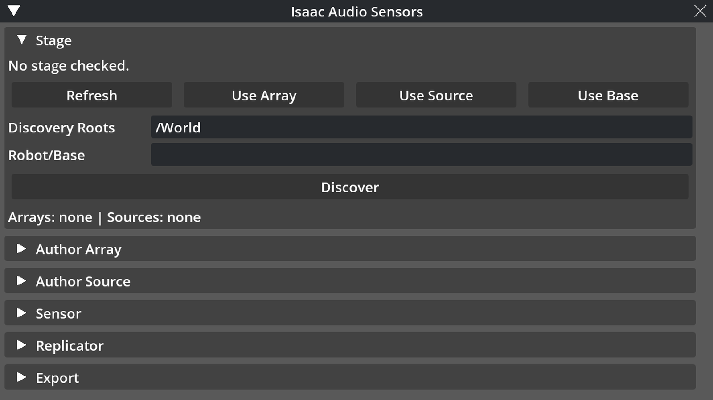

# Isaac Sim and Kit

## Live Stage Integration

`IsaacAudioArraySensor` in `isaac_audio_sensors.isaac.sensor` binds an explicit array on a live stage or discovers authored sources and arrays from configured USD roots. There is no offline `from_config()` path.

Discovery uses `ias:*` metadata, compatible native sound attributes, USD type/name signals, child microphone prims, optional object/base context, filters, and deterministic preference rules.

The pose resolver prefers `UsdGeom` world-transform APIs and falls back to authored `ias:` positions, orientations, and simple `xformOp` parent stacks for import-safe tests and duck-typed stages.

Import-safe world bounds and room-absorption helpers live in `isaac_audio_sensors.isaac.usd_bounds` and are shared by Isaac Sim, Isaac Lab, and Kit.

Each emitted frame can carry `stage_snapshot` diagnostics for selected prims, discovery reasons, pose provenance, time code, source/array/microphone transforms, and optional object/base context.

## NVIDIA Audio Schema Bridge

The public helpers remain `create_sound_prim` and `create_listener_prim`, but they author only NVIDIA's current `OmniSound` and `OmniListener` types. Updating a deprecated `Sound` or `Listener` prim through these helpers retypes it to the current schema. Discovery checks the current types first and still reads both deprecated aliases for existing stages.

The SDK-facing source arguments stay in ergonomic units. `spatial` maps to `auralMode`; `AudioSourceSpec.loop_count` maps to `loopCount`, where `-1` is infinite, `0` is one play, and positive values are additional repeats. The legacy authoring argument `loop` remains available for the `0`/`-1` cases, but conflicting combinations are rejected. Finite dB gain maps to positive linear `gain`, and source seconds map through the stage time-code rate to `startTime` and optional `endTime`. Robot-mounted listeners author `orientationFromView=false` by default. Microphone arrays remain `Xform` prims with `ias:*` metadata and microphone children; an `OmniListener` is only an optional Kit Audio bridge.

Real audio assets author both native `filePath` and `ias:audio_asset_path`. SDK-generated identifiers such as `generated://pulse` author only `ias:audio_asset_path` because Kit Audio cannot play them as files. Discovery applies configurable `ias`, native USD, and default precedence, converts native time codes, loop count, and linear gain back into the portable contract, treats negative native `startTime` as disabled, and rejects non-positive native gain when no finite `ias:gain_db` value takes precedence. `auralMode=nonSpatial` sources are omitted from physical-sensor discovery with an explicit diagnostic, including during strict candidate scans, because they do not represent spatial emitters whose poses should propagate to individual microphones. Explicitly selecting one as a physical source remains an error.

For the room-acoustics backend, a file-backed source repeats its decoded content up to the requested `loop_count` within the authoritative `duration_s` derived from `endTime`; any remaining finite window is silent. Infinite loops fill that window and therefore remain bounded. `generated://` sources stay duration-driven and do not acquire file-loop semantics.

The Kit extension declares `omni.usd.schema.audio` directly. Discovery-cache invalidation includes `auralMode`, `loopCount`, and `endTime`, and `discovery.py` is the sole stage-to-source reader.

## Discovery Cache and Motion

Steady-state updates reuse discovered prim identities and re-read their current transforms; stage notices invalidate the cache when relevant prims or properties change.

`rediscover()` is the explicit recovery path, while a configuration flag can force full discovery each update when a dynamic authoring workflow needs it.

Pose history derives bounded velocities and resets on lifecycle discontinuities, stale timestamps, or teleport-like changes according to configured policy.

Lazy timeline time, update subscriptions, and reset subscriptions share one Isaac lifecycle helper. Anchored-room refresh belongs to stage-snapshot helpers, while occlusion pair comparison, refresh reasons, and material diagnostics stay inside the occlusion module.

## Occlusion and Visualization

Optional PhysX raycasts compute per-source/per-microphone occlusion and material transmission; missing runtime support produces a clear optional-capability error.

Visualization is represented first as pure structured debug primitives, then rendered through lazy debug draw or persistent session-layer USD geometry when available.

The latest frame registry supports Kit instruments, Script Nodes, and the optional OmniGraph node without coupling the core frame contract to a GUI.

## Extension Lifecycle

Add the repository `exts/` directory to Isaac Sim Extension Manager search paths or use the supported installer, then enable `Isaac Audio Sensors` and open it from `Window -> Isaac Audio Sensors`.

The action ID is `isaac_audio_sensors.omni::toggle_window`; the default shortcut is `Ctrl+Alt+A` when the optional Kit hotkey service is available.

The extension imports without `omni`, `pxr`, CUDA, Torch, Replicator, or a display; live APIs are resolved only inside the operations that require them.

The entrypoint exposes its `controller` and has no duplicate sensor, authoring, export, or Replicator proxies. The controller composes internal lifecycle, authoring, sensor-session, recording-workflow, Kit Audio, Replicator, and configuration services; the window and sections only render state and invoke controller actions.

Shutdown independently cancels an active recording as incomplete, releases Kit Audio capture and listener state, stops Sensor WAV audition, Replicator, and the sensor, clears debug/frame state, detaches workflow/window callbacks, and releases update, stage, reset, hotkey, menu, and action registrations even if one cleanup fails. Opening, closing, or replacing a stage also releases the Kit Audio resources.

## Kit Scene Audition and Mix Capture

`OmniSound` remains the single NVIDIA stage representation of a passive source, while discovery converts it to `AudioSourceSpec` for the selected sensor backend. The Kit Audio service is a separate audition bridge: it never becomes a sensor backend and never writes `AudioSensorFrame`, recordings, datasets, Replicator output, or Isaac Lab observations.

`Activate Array Listener` reuses only a direct array child whose local transform is static identity, whose `orientationFromView` is false, and whose optional `ias:array_id` matches the array. A global, offset, view-oriented, animated, reset-stack, or mismatched listener is preserved but not reused. When no compatible child exists, the service creates a temporary child in the USD session layer, so it follows the array pose without changing the saved stage. Activation retries Hydra registration for a bounded number of Kit updates. Restore and cleanup reactivate the previous listener only while the managed listener is still active; a user-selected replacement is preserved.

`Start Kit Mix Capture` and `Stop Kit Mix Capture` own one capture streamer and use the current Kit timeline without starting, stopping, or repositioning it. Capture is refused unless the stage has a file-backed `OmniSound` that Kit reports as playable. Stop performs `stop_capture -> wait_for_capture -> destroy_capture_streamer`, then verifies the real WAV, rejects empty or silent output, and reports its actual path, channel count, sample rate, and duration. Files live under `build/validation/isaac_audio_sensors/kit_audio_captures/` by default. Concurrent third-party capture streamers are intentionally unsupported because Kit can restart and overwrite other streamers when one starts or stops.

The UI permanently labels this path `Kit listener/device mix — qualitative, not microphone-array channels`. Its channels and format belong to the active audio device and speaker layout. Sensor WAV playback remains a separate microphone-array operation.

## Native Kit Window

The native `omni.ui` window has exactly three top-level areas: Guided Workflow, Live Monitor, and Advanced Tools. Guided and Live Monitor are open on first use, while Advanced Tools is closed. Guided and Advanced are mutually exclusive accordions; Live Monitor remains independently available as the primary operating surface.

The fixed status strip remains visible below the scrollable content. Its priority is error, recording, active or stale-frame warning, last operational action, then ready. Errors identify the affected section and field or action with a direct recovery instruction. View code reads controller state and invokes controller actions only. It does not access USD, files, or recording internals directly.

## Guided Workflow

The guided path is `Setup -> Validate -> Run -> Inspect -> Record -> Export`. Six non-interactive indicators distinguish completed, current, blocked, and upcoming steps, while one concise instruction states the next required action.

Only the current step is expanded. It exposes one primary action, with Back and recovery actions secondary. Setup applies a maintained safe preset and stage bindings; Validate runs stage, backend, device, source, array, room, attachment, calibration, and capability checks; Run and Inspect reuse the same canonical sensor control as Live Monitor; Record exposes Start Recording, then Stop & Finalize, with Cancel separate; Export validates, splits when requested, and inventories the result. Capability validation refreshes stale cached facts within the same pass.

Guided is open by default and stores its local collapse preference at `/persistent/exts/isaac_audio_sensors.omni/ui/guided_collapsed`. Missing `carb.settings` falls back safely to the default. `guided_mode_enabled=False` still removes Guided completely, and the local preference is not part of exported configuration.

Simulator reset starts a new episode, and partial or failed recording output is not promoted as a complete session.

The headless path is `isaac_audio_sensors.kit.headless.HeadlessGuidedSession`; callers inject an `ExtensionController`, and the CLI owns construction of the default controller.

## Live Monitor

Live Monitor shows sensor state, backend, frame freshness, detection count, and waveform availability on separate rows. Frame freshness uses an internal monotonic UI receipt clock, while the full frame ID and simulated timestamp remain in Advanced Tools. One compact contextual button starts or stops the sensor.

The live instruments separate bearing, sector, confidence, and occlusion below the compass. Up to eight microphone RMS meters use a native `-60 ... 0 dBFS` scale with adjacent values and no percentages. Recent detections occupy zero to three rows without an internal scroll area, and the empty states distinguish no frame from a valid frame with no detections.

## Advanced Tools

Advanced Tools contains the specialist controls for stage and selection, array, source, sensor settings and debug, room, Sensor WAV output, Kit scene audition, Replicator, export, and configuration. Stage binding uses one `Bind selection as` selector and `Bind Selected`; position authoring uses a preset selector and `Apply Position Preset`. Known profiles and rigs are selected with combo boxes and validated by Apply rather than duplicate selection buttons.

Numeric settings use drag widgets, enumerated choices use combo boxes, and string fields remain limited to identifiers, paths, and free text. Color styling distinguishes editable, action-populated, read-only, and invalid fields. Preset, binding, transform-read, and config-import changes are tracked only as transient window state; a manual edit restores the normal editable style. Invalid fields remain highlighted until a valid correction, without opening or changing accordions automatically. All maintained controller capabilities remain reachable here without duplicating lifecycle controls that are simultaneously visible in Live Monitor.

Replicator controls the optional Omniverse writer; Export writes the latest frame, JSONL streams, and reusable binding/configuration JSON.

Viewport follow-selection and live pose synchronization let manipulator edits update the selected stage entities without copying transforms into task-specific code.

## OmniGraph and Replicator

When `omni.graph.core` is available, the extension registers `isaac_audio_sensors.omni.IsaacAudioSensorFrame` version 1 through `og.register_node_type` without `.ogn` code generation.

The node publishes the latest frame ID, timestamp, detection count, bearing, sector, microphone IDs/RMS, occlusion state, and JSON payload, optionally filtered by array key.

Replicator integration is a lazy Isaac bridge used by the extension; core frames, package JSON/JSONL writers, the base sensor capture path, and Isaac Lab do not require it. The registered writer receives frames directly from extension updates. The v1 payload and configuration retain `annotator_name` as compatibility metadata, but no runtime annotator is registered.

Kit services own profile libraries, validation, output paths, and application persistence. The sensor-session service appends JSONL only for new frames and injects a constructed core `WaveformSink`; the live sensor uses and closes that sink without knowing UI paths or output modes.

## Troubleshooting

If there is no stage or selection, create/open a stage and refresh before authoring; every prim path must be absolute.

If discovery is empty, verify the selected roots and authored metadata, then run rediscovery; if a moved prim does not change a frame, verify live pose sync, cache invalidation, and the stage time code.

If start/update fails, read the exact validation finding for backend, dependency, device, array geometry, source, room, or output path instead of changing unrelated settings.

If overlays or OmniGraph are unavailable, distinguish optional Kit-service absence from sensor failure; frame JSON and structured diagnostics remain the primary contract.

If Replicator is unavailable, use package JSON/JSONL or the generic session recorder; a Replicator blocker must not be reported as a core package failure.

If Kit mix capture is refused, verify that at least one `OmniSound` has a real `filePath` and has finished loading. `generated://` sources are valid for SDK backends but are not playable Kit assets. Treat the captured WAV only as a qualitative active-listener/device mix; use Sensor WAV output for microphone-array channels.

## Version Notes

- 2026-08-26: Clarified direct Replicator writer updates and retained the v1 annotator name as metadata without registering a runtime annotator.
- 2026-08-24: Made non-spatial exclusion non-fatal during strict scans and restricted listener reuse to compatible direct array children.
- 2026-08-24: Added complete finite/infinite `loopCount` conversion and room-backend repetition, excluded non-spatial sources from physical-sensor discovery, and introduced array-listener reuse with a session-layer fallback plus qualitative Kit device-mix capture without changing sensor observations.
- 2026-08-24: Migrated authoring and live validation to `OmniSound` and `OmniListener`, corrected native schema units and metadata precedence, and retained deprecated-alias read compatibility.
- 2026-08-24: Refined the existing three-area UI with visual guided indicators, actionable feedback, monotonic frame freshness, dBFS meters, adaptive detections, field-specific recovery, and transient field provenance without changing controller, serialization, or audio contracts.
- 2026-08-24: Rebuilt the native Kit UI around the three task-oriented areas, added persistent Guided collapse behavior, promoted Live Monitor to the canonical operating surface, and moved specialist controls into Advanced Tools without changing core APIs or serialized contracts.
